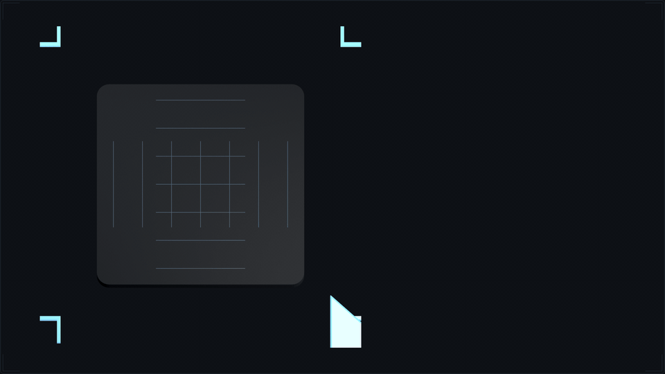
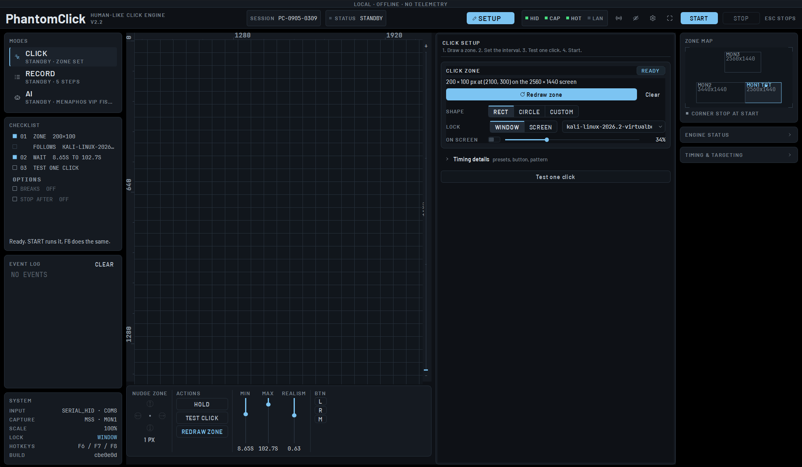
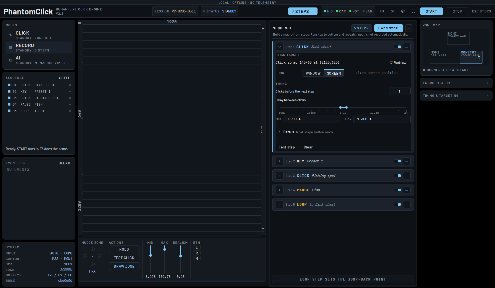
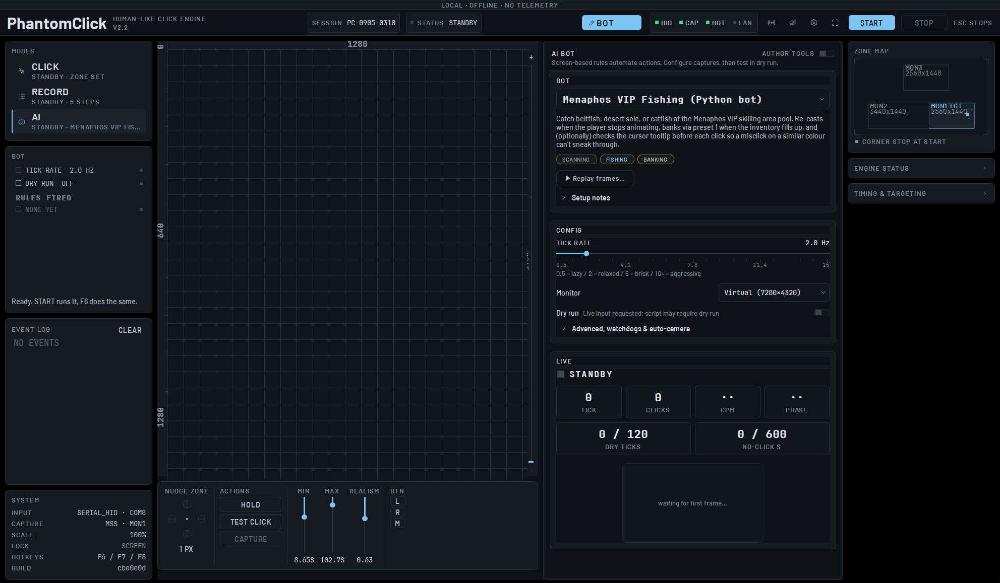

# PhantomClick

A Windows auto-clicker built around one idea: what looks human is human enough.
The cursor travels along curved paths, dwells, jitters, tires and takes breaks.
Clicks land at random points inside an area you draw. Timings come from
log-normal distributions, not a uniform range.

> **Work in progress.** PhantomClick is under active development. The Click and
> Record modes are usable today. The AI mode ships with example bots that start
> in dry run and need per-game setup before they do anything useful. Expect
> rough edges, missing features and layout changes between releases. Bug
> reports go in [Issues](https://github.com/Roach9223/PhantomClick/issues).

Everything runs locally. Offline by default, no telemetry, no auto-update. The
two optional network features (a LAN screen stream for your phone and item
image downloads from the RuneScape wiki) are off until you turn them on.



---

## Download and run

No Python, no installer. One file.

1. **[Download PhantomClick.exe](https://github.com/Roach9223/PhantomClick/releases/latest/download/PhantomClick.exe)**. On the [Releases](https://github.com/Roach9223/PhantomClick/releases/latest) page it is under **Assets**. Take the `.exe`, not "Source code".
2. Double-click it.
3. A splash screen shows for about ten seconds while the app unpacks. Later launches are faster.
4. If Windows says "Windows protected your PC", click **More info**, then **Run anyway**. The exe is unsigned, so that prompt is normal.

Windows 10 or 11. On first run it writes `config.json` and `phantomclick.log`
next to the exe, so put the file in a folder of its own.

---

## What it looks like

The whole app is one screen. Modes and the checklist on the left, the live view
of your target monitor in the middle, the editor for the active mode on the right,
and the zone map and telemetry at the far right. The live view is blanked in
these screenshots.

**Click mode.** Draw a zone on your screen, set the wait, test one click, press START. The zone can follow a window, and the LOCK row lists every open window so you can switch targets in one pick.



**Record mode.** Build a macro from steps: click zones, key presses, pauses,
colour matches, tracked targets and loops. It runs top to bottom and repeats.
It does not record your mouse; you place each step yourself.



**AI mode.** Rule-based bots that read the screen and act through the same
humanizer. Bundled examples are for RuneScape 3 and start in dry run.



---

## First run

1. Pick **Click** and press **Draw area** in the Setup pane (or **REDRAW ZONE**
   on the deck). Drag a box over the thing you want clicked.
2. Set the shortest and longest wait between clicks with the MIN and MAX
   sliders on the deck.
3. Press **Test one click** to watch a single click land.
4. Press **START**. F8 holds and resumes, F7 stops, Esc stops from anywhere.

The eye button in the header shows the area as a lime outline on your real
screen. Right-click the live view to drop a click area at that exact point,
add steps, change zoom or pick the target monitor.

---

## Features

| Area | What it does |
|---|---|
| Humanization | Curved movement with overshoot and jitter, log-normal delays, fatigue and scheduled breaks, idle wander, anti-cluster targeting. One realism dial drives it all. |
| Areas | Rectangle, circle or custom polygon, with a centre bias. Areas can follow the window they were drawn over. |
| Tracking | Template matching follows a moving target; extra views handle rotation and camera angle. |
| Colour steps | Pick a colour, click any matching pixel within tolerance, optionally inside an area. |
| Hotkeys | Global Start, Stop and Hold (F6, F7, F8 by default). Moving the cursor into a screen corner stops everything. |
| Key timers | Passive key presses on a schedule, for things like a potion every six minutes. |
| Monitor | Opt-in LAN screen stream with token-protected Start and Stop from your phone. |
| Keyboard backends | SendInput, the Interception driver, or Serial HID through an Arduino Leonardo running the PhantomHID sketch in `firmware/`. |

---

## Run from source

Python 3.11 is required. The bundled Rust vision core in `rs3vision/` is built
for 3.11 and numpy 1.x.

```powershell
git clone https://github.com/Roach9223/PhantomClick.git
cd PhantomClick
py -3.11 -m venv .venv
.venv\Scripts\activate
pip install -r requirements.txt
python main.py
```

Optional backends: `pip install interception-python` (needs the Interception
driver and a reboot) and `pip install pyserial` (Arduino HID).

## Build the exe

```powershell
pwsh -File build.ps1               # installs requirements, then builds
pwsh -File build.ps1 -SkipInstall  # build only
```

Output is `dist\PhantomClick.exe`. The script finds Python 3.11 for you and
refuses anything else. PyInstaller settings live in `PhantomClick.spec`.

## Tests

```powershell
python -m pytest -q
```

Unit, layout and synthetic replay checks. The suite never touches your real
`config.json` and fails loudly if anything tries. For a real-input check, run
`python scripts/verify_click_target.py`; it opens its own target window and
clicks into that only. Scope and gaps are in [docs/validation.md](docs/validation.md).

---

## Configuration

`config.json` sits next to the app and is never committed. It holds your screen
calibration, Monitor token and serial port. Settings save on every change; there
is no Save button. Saves are atomic and keep the previous good file as
`config.json.bak`, which the app restores from if the main file goes missing.

Monitors are remembered by name, model and geometry, not just by position in
the list, so a display that changes order after a reboot still resolves to the
right screen. If a saved monitor is unplugged the app refuses to start and says
so in the banner under the header.

---

## Project layout

```
main.py            entry point
ui/                PySide6 GUI: the command deck, editors, widgets, overlays, theme, LAN monitor
modules/           click engine, recorder, tracker, hotkeys, key input, sequence presets
utils/             humanizer, fatigue, idle wander, paths, logger
ai/                rule-based bot framework and bundled example bots
rs3vision/         prebuilt Rust vision core (Python 3.11)
firmware/          PhantomHID Arduino sketch
packaging/         exe icon, splash image and the scripts that make them
scripts/           manual probes for the input backends, plus the real-input check
tests/             pytest suite
docs/              screenshots, validation notes, monitor identity, hardware wiring
```

`CLAUDE.md` is the full project spec. `gameplan.md` is the long-term roadmap.

---

## License

[MIT](LICENSE).

PhantomClick is an independent input-automation tool. It is not affiliated with
or endorsed by any game publisher. Automating a game may break its terms of
service. Use it at your own risk.
