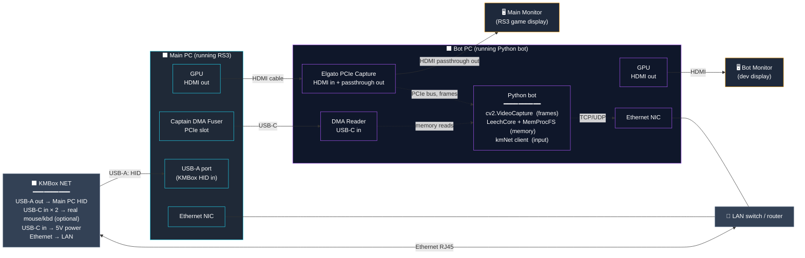

# Hardware Wiring Diagram

The Phase 2 hardware topology. Mermaid diagram renders inline in GitHub, VS Code (with Mermaid extension), Obsidian, and most modern markdown viewers. ASCII fallback below for terminals.

---

## Mermaid (renders as a real diagram)



---

## ASCII fallback

```
─── HDMI PATH ──────────────────────────────────────────────────────

Main PC GPU
   │ HDMI cable
   ▼
Elgato Capture Card  (Bot PC PCIe slot)
   │    ╲ PCIe bus
   │     ╲────────────────→ cv2.VideoCapture on Bot PC  (frames)
   │ HDMI passthrough out
   ▼
Main Monitor  (the one you currently play on — RS3 displays here)


─── DMA PATH ───────────────────────────────────────────────────────

Captain DMA Fuser card  (Main PC PCIe slot, x4 minimum)
   │ USB-C port 1
   ▼
DMA Reader  (plug into Bot PC USB 3.0+ port)
   ↑
   ╰── LeechCore / MemProcFS read Main PC RAM through this cable

   USB-C port 2 — typically unused on RS3 setups
                  (some Captain DMA models reserve for fiber, clock-
                  sync, or chained-reader use cases)


─── KMBox NET PATH ─────────────────────────────────────────────────

KMBox NET  (standalone unit, not inside either PC)

   Port A  USB-A out  ─→  Main PC USB port
                          (Main PC enumerates this as a real mouse +
                          keyboard composite HID device)

   Port B  USB-C/A in ─←  Your real physical mouse  (optional —
                          for "live override" modes where you play
                          and the bot augments your movement; leave
                          unused for pure bot operation)

   Port C  USB-C/A in ─←  Your real physical keyboard  (same idea)

   Port D  USB-C power ─←  5V power adapter
                          OR  some units draw power from Port A
                          — check your manual

   Ethernet RJ45      ─→  LAN switch / router
                          ↑
                          Bot PC reaches it over TCP/UDP at
                          kmbox.local or DHCP-assigned IP

Pure bot setup needs only:  Port A + Ethernet + power.


─── BOT MONITOR ────────────────────────────────────────────────────

The "extra monitor not currently in use" plugs into Bot PC's GPU
directly — no Elgato involved.

Bot PC GPU
   │ HDMI cable
   ▼
Bot Monitor — Python bot UI, log tail, cv2 imshow previews,
              Ghidra (Phase 3 offset work), MemProcFS shell, etc.


─── NETWORK ────────────────────────────────────────────────────────

Both PCs and KMBox NET on the same LAN switch / router:

    Main PC   ─── ethernet ─── ┐
                                ├─── LAN switch ─── (home network)
    Bot PC    ─── ethernet ─── ┤
                                │
    KMBox NET ─── ethernet ─── ┘

Bot PC's Python connects to KMBox NET's IP over TCP/UDP. NO traffic
crosses the open internet. If your router uses "AP isolation" or
"guest mode" for clients, turn it off on the relevant subnet.


─── WHAT MAIN PC SEES (the NXT-blind summary) ──────────────────────

To NXT and Windows on Main PC, the world looks like:

  • a HDMI monitor    (Elgato passthrough — passive sink)
  • a USB HID device  (KMBox NET — generic mouse + keyboard composite)
  • a PCIe device     (Captain DMA Fuser — generic vendor ID, no
                       driver interaction beyond enumeration)
  • an Ethernet card  (already there — KMBox NET is on a different
                       cable; Main PC and KMBox don't talk)

No process. No file. No driver. No window. Nothing software-side.
```

---

## Cable BOM (bill of materials)

Every cable you need to physically run. All standard, no specialty parts.

| # | Cable | From → To | Notes |
|---|---|---|---|
| 1 | HDMI | Main PC GPU → Elgato HDMI IN | 4K60 capable; HDMI 2.0 or 2.1 |
| 2 | HDMI | Elgato HDMI OUT → Main Monitor | Same spec as #1 |
| 3 | USB-C | Captain DMA Fuser Port 1 → Bot PC USB 3.0+ | High-speed USB-C — comes with the DMA card typically |
| 4 | USB-A | KMBox NET Port A → Main PC USB | Standard USB-A to USB-A (or whichever connector your KMBox uses for HID out) |
| 5 | USB-C | Power adapter → KMBox NET power port | 5V, sufficient for unit's draw — check spec |
| 6 | Ethernet (Cat5e/6) | KMBox NET RJ45 → LAN switch | Standard ethernet |
| 7 | Ethernet | Main PC NIC → LAN switch | Already in place typically |
| 8 | Ethernet | Bot PC NIC → LAN switch | Already in place typically |
| 9 | HDMI | Bot PC GPU → Bot Monitor | Independent of capture path |

Optional (real-mouse/keyboard passthrough mode):

| # | Cable | From → To |
|---|---|---|
| 10 | USB | Real mouse → KMBox NET Port B |
| 11 | USB | Real keyboard → KMBox NET Port C |

---

## Verification checklist (after physical install)

Walk through each row top-to-bottom. Each step is independent and verifiable.

1. **HDMI path:** plug everything in. Main Monitor shows RS3 normally. *No software running yet — just the passive HDMI signal flowing through Elgato.*
2. **Elgato visible on Bot PC:** Bot PC Device Manager / `cv2.VideoCapture(0, cv2.CAP_DSHOW).read()` returns a non-None frame matching Main PC's display.
3. **KMBox visible on Main PC:** Main PC Device Manager lists "KMBox NET HID" (or generic "USB Composite Device") under Human Interface Devices.
4. **KMBox reachable on LAN:** `ping kmbox.local` (or its assigned IP) from Bot PC succeeds.
5. **Test mouse command end-to-end:** `python -c "import kmNet; kmNet.init('192.168.x.x', '<port>', '<uuid>'); kmNet.move(500, 500); kmNet.left(1)"` from Bot PC. Cursor on Main PC moves to (500, 500) and left-clicks. *Test against Notepad first, then RS3.*
6. **DMA Fuser visible on Main PC:** Device Manager shows an unknown PCIe device (this is correct — generic vendor ID).
7. **DMA Reader visible on Bot PC:** LeechCore CLI `LeechCore.exe -device fpga` returns the device handle.
8. **DMA memory read:** `pcileech.exe -device fpga -out console dump 0x1000 0x100` returns bytes (any bytes; we're just confirming the channel works).

Steps 1–4 are hardware-only. Steps 5–8 are the first software touches. If any step fails, *do not proceed* — debug it in isolation before moving on. The whole stack only works because each layer is independent; troubleshooting an integration bug on layer 8 when layer 3 is silently broken is a nightmare.

---

## Reference: links

- KMBox NET docs: [Amazon listing](https://www.amazon.com/Keyboard-Controller-DMA-Kmbox-net-Converter/dp/B0D9BS75YC) *(public spec page)*
- Captain DMA cards: [captaindma.com/shop](https://captaindma.com/shop/) *(vendor)*
- LeechCore / MemProcFS: [github.com/ufrisk/LeechCore](https://github.com/ufrisk/LeechCore), [github.com/ufrisk/MemProcFS](https://github.com/ufrisk/MemProcFS) *(open-source)*
- Ghidra: [ghidra-sre.org](https://ghidra-sre.org)
